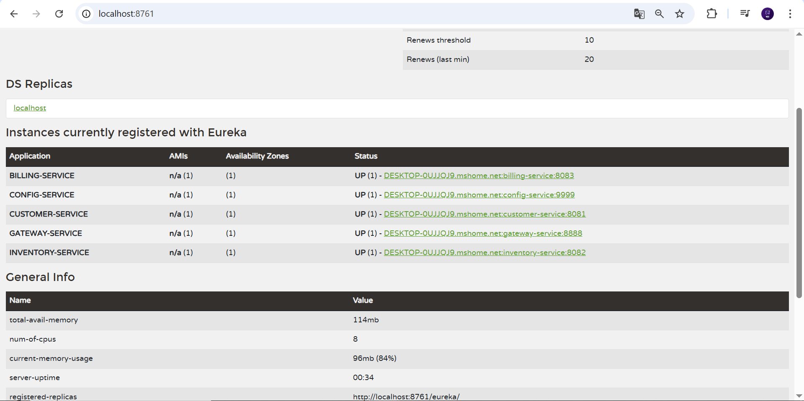
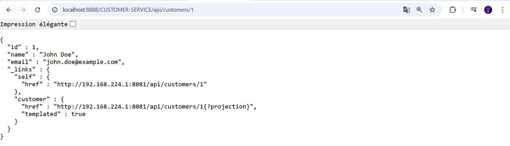
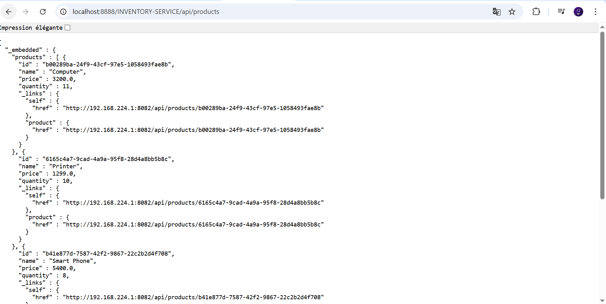
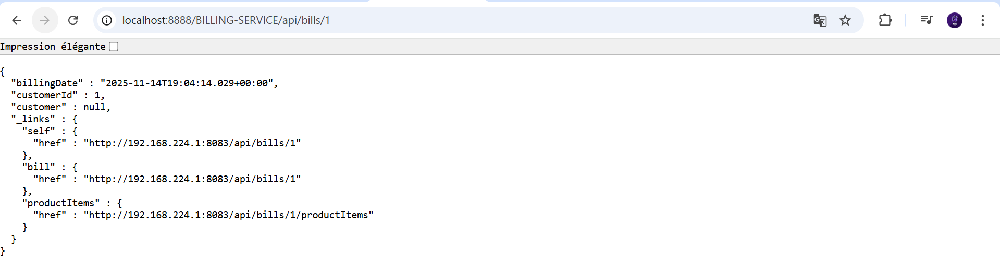

1-Architecture du projet

L’application est composée des microservices suivants :

discovery-service : serveur Eureka pour l’enregistrement et la découverte des services.

config-service : serveur de configuration Spring Cloud.

config-repo : dépôt Git contenant les fichiers de configuration.

gateway-service :  Gateway.

customer-service : gestion des clients.

inventory-service : gestion des produits.

billing-service : gestion des factures.

2-Démarrer les services dans cet ordre :
1-discovery-service
2-config-service
3-customer-service
4-inventory-service
5-billing-service
6-gateway-service

